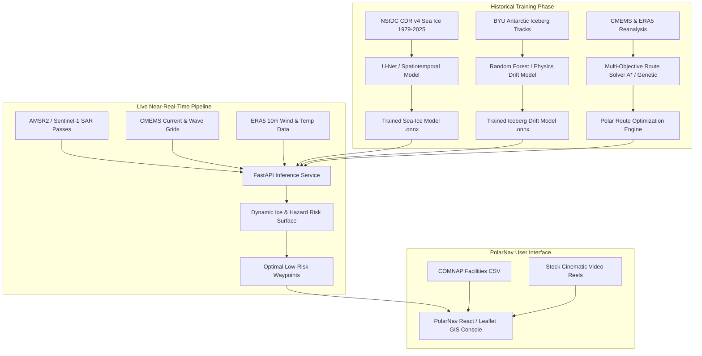

# PolarNav AI — Data, API & Machine Learning Audit

**Project:** PolarNav AI — Antarctic Navigation Intelligence System  
**Hackathon Problem:** SIH 2026 / Problem ID: 26059 (Ministry of Earth Sciences / NCPOR)  
**Audit Date:** October 1, 2026  

---

## 1. CURRENT FRONTEND DATA SOURCES

| Source Name | File / API Location | Real or Mock? | Where Used in Frontend | Requires API Key? |
| :--- | :--- | :--- | :--- | :--- |
| **COMNAP Antarctic Research Facilities** | `client/src/data/stations/antarctic_facilities.csv` | **REAL** | Station markers on map, search bar, facility type/country/seasonality filters, right telemetry panel. | No |
| **Antarctic Navigation Demo Dataset** | `client/src/data/antarcticDemoData.js` | **MOCK / DEMO** | ORV Sagar Nidhi vessel position & telemetry, iceberg targets IB-001–007, AI recommended route, alternative route, risk hazard zones. | No |
| **MapTiler Basemap Tiles** | `https://api.maptiler.com/maps/...` | **REAL** | Satellite, Ocean, and Topo raster base layers in `MapBaseLayer.jsx`. | **YES** (`VITE_MAPTILER_API_KEY`) |
| **Esri World Imagery / CARTO Dark (Fallback)** | `https://server.arcgisonline.com/...` / `cartocdn.com` | **REAL** | Fallback basemap tiles when MapTiler key is unconfigured. | No |
| **Homepage Video Assets** | `client/public/videos/*.mp4` | **REAL** | Fullscreen background videos in `HeroVideo.jsx` and `CinematicLanding.jsx`. | No |

---

## 2. MAP AUDIT

* **Map Library:** Leaflet (`leaflet` v1.9.4) via React-Leaflet (`react-leaflet` v5.0.0).
* **MapTiler Usage:** MapTiler Satellite (`/maps/satellite`), Ocean (`/maps/ocean`), and Topo (`/maps/topo-v2`) raster tile layers.
* **Exact Environment Variable:** `VITE_MAPTILER_API_KEY` (configured in `client/.env`).
* **Tile Types Supported:** 512px raster tiles (MapTiler) and 256px raster tiles (Esri / CARTO / OpenTopoMap fallback).
* **Does the Map Currently Work? YES.** 
  * When `VITE_MAPTILER_API_KEY` is provided, the application loads high-resolution MapTiler tiles.
  * When `VITE_MAPTILER_API_KEY` is missing or set to placeholder, `MapBaseLayer.jsx` automatically uses Esri World Imagery (Satellite), CARTO Dark Matter (Ocean), or OpenTopoMap (Topo), ensuring the map **never turns black or blank**.

---

## 3. SEA-ICE DATA & MODELING AUDIT

### Current Status
The current frontend displays **simulated sea-ice risk zones** (`DEMO_RISK_ZONES` in `antarcticDemoData.js`) and simulated sea-ice concentration percentages in point telemetry. **No live satellite raster feed or ML sea-ice model is currently connected.**

### Planned Real Data & ML Implementation

```
Historical Dataset (NSIDC CDR v4 1979-2025)
       ↓
CNN / U-Net Spatiotemporal Architecture
       ↓
Sea-Ice Concentration (SIC) & Fracture Predictor
       ↓
5-Day Dynamic Sea-Ice Forecast Raster Grids
```

* **Historical Training Dataset:** NOAA/NSIDC Climate Data Record (CDR v4) of Passive Microwave Sea Ice Concentration (1979–2025, 25km grid) and AMSR2 daily 3.125km grids.
* **Current / Near-Real-Time Input:** Daily AMSR2 (Advanced Microwave Scanning Radiometer 2) passive microwave brightness temperatures and Sentinel-1 SAR imagery.
* **Target ML Predictions:**
  1. 5-day to 14-day gridded Sea Ice Concentration (SIC %) forecast across the Southern Ocean.
  2. Ice pressure ridge and fracture line probability map.
  3. Freeze-up and thaw anomaly index relative to 30-year climate baselines.

---

## 4. ICEBERG DETECT & TRAJECTORY AUDIT

### Current Status
The current frontend displays **7 mock iceberg targets** (`IB-001` through `IB-007`) located around Prydz Bay, Amery Ice Shelf, and Davis Sea with static attributes (length, width, risk score, drift speed).

### Planned Real Data Pipeline

* **Antarctic Historical Iceberg Dataset:** BYU Antarctic Iceberg Tracking Database (BYU/SCP) and US National Ice Center (NIC) Antarctic Iceberg Database (tracking major tabular bergs >10nm like A-84, B-15).
* **Satellite Detection Source:** Copernicus Sentinel-1 Synthetic Aperture Radar (SAR) Extra-Wide (EW) and Interferometric Wide (IW) C-band imagery (penetrating cloud cover and polar night).
* **Ocean Current Predictors:** Copernicus Marine Service (CMEMS) Southern Ocean 3D Velocity Grids ($u, v$ surface & sub-surface geostrophic currents).
* **Sea-Ice Friction Predictors:** NSIDC Sea Ice Drift & Concentration Grids (modeling sea-ice momentum transfer to icebergs).
* **Wind / Atmospheric Predictors:** ERA5 Reanalysis 10m Wind Vectors ($u_{10}, v_{10}$) & Surface Atmospheric Pressure.
* **Geographic Coverage Guarantee:** Restricted strictly to Antarctic latitudes ($>60^\circ\text{S}$), avoiding Arctic-only databases like the USCG International Ice Patrol.

---

## 5. OCEAN & WEATHER AUDIT

The planned production architecture will ingest data from two primary meteorological services:

### 1. Copernicus Marine Service (CMEMS)
* **Ocean Surface Currents ($u, v$):** For vessel drift & iceberg hydrodynamic forcing.
* **Sea Surface Temperature (SST):** For thermal ice-melting rate equations.
* **Significant Wave Height ($H_s$) & Wave Period ($T_p$):** For vessel motion stability and ice floe breakup modeling.
* **Mixed Layer Depth:** For upper-ocean heat capacity calculations.

### 2. ERA5 Reanalysis (ECMWF / C3S)
* **10m Wind Speed & Direction ($u_{10}, v_{10}$):** For wind stress on icepack and vessel leeway.
* **2m Air Temperature ($T_{2m}$):** For freezing degree-days and ice growth prediction.
* **Surface Atmospheric Pressure ($P_{msl}$):** For polar cyclone tracking and atmospheric pressure gradient winds.

---

## 6. ROUTE OPTIMIZATION AUDIT

### Current Status
The routes displayed on the map (`DEMO_RECOMMENDED_ROUTE` and `DEMO_ALTERNATIVE_ROUTE`) are **hard-coded calibrated demonstration waypoints**.

* **AI Recommended Low-Ice Corridor:** 312.4 NM waypoint sequence skirting consolidated pack ice in Prydz Bay.
* **Conventional Direct Rhumb Line:** 278.5 NM direct geographic path traversing high-density pack ice.

> **Audit Note:** The current route is **NOT** generated by a live optimization algorithm or machine-learning model. It is a curated demonstration scenario for SIH evaluation.

---

## 7. MACHINE LEARNING MODEL AUDIT

### Search Results for Binary Models & Training Scripts

| File Type | Search Pattern | Files Found | Details |
| :--- | :--- | :--- | :--- |
| **Pickle Models** | `*.pkl` | **0** | None present |
| **Joblib Models** | `*.joblib` | **0** | None present |
| **PyTorch Checkpoints** | `*.pt`, `*.pth` | **0** | None present |
| **ONNX Models** | `*.onnx` | **0** | None present |
| **TensorFlow / Keras** | `*.h5`, `*.keras` | **0** | None present |
| **Python Scripts** | `*.py` | **0** | None present |
| **Jupyter Notebooks** | `*.ipynb` | **0** | None present |

---

### Audit Answer

### **DO WE CURRENTLY HAVE A TRAINED MODEL? NO.**

> **Status Explanation:**  
> The current PolarNav project is a **high-fidelity React/Vite frontend demonstration system** utilizing calibrated demonstration datasets (`antarcticDemoData.js`) and real COMNAP Antarctic facility CSV records (`antarctic_facilities.csv`). An actual trained ML model (PyTorch / ONNX) and Python FastAPI backend inference server still need to be built and integrated.

---

## 8. ENVIRONMENT VARIABLES & KEYS

| Variable Name | Service | Required? | Frontend / Backend? | Safe to Expose Publicly? | Where Stored |
| :--- | :--- | :--- | :--- | :--- | :--- |
| `VITE_MAPTILER_API_KEY` | MapTiler Tiles | Optional (Has Esri Fallback) | Frontend | **YES** (Restricted by HTTP Referer domain) | `client/.env` |
| `VITE_API_URL` | PolarNav FastAPI Backend | Optional (Defaults to Mock Data) | Frontend | **YES** | `client/.env` |
| `COPERNICUS_CAS_USER` | Copernicus Marine Data | Required for Backend ML Ingestion | Backend | **NO** (Secret Credential) | Server `.env` |
| `COPERNICUS_CAS_PASSWORD` | Copernicus Marine Data | Required for Backend ML Ingestion | Backend | **NO** (Secret Credential) | Server `.env` |
| `NOAA_EARTHDATA_TOKEN` | NSIDC Earthdata API | Required for Backend ML Ingestion | Backend | **NO** (Secret Token) | Server `.env` |

---

## 9. FINAL SYSTEM ARCHITECTURE



---

## WHAT WE CAN CLAIM IN THE SIH DEMO TODAY

### ✅ IMPLEMENTED (Real & Functional Today)
1. **Antarctic GIS Interactive Map Console:** Built on Leaflet & React-Leaflet with MapTiler Satellite, Ocean, and Topo base layers (and Esri World Imagery fallback).
2. **COMNAP Antarctic Research Facilities Database:** Real CSV dataset (`antarctic_facilities.csv`) containing 100+ Antarctic research stations and camps, fully searchable and filterable by country, facility type, and seasonality.
3. **Cinematic Landing Interface:** Auto-transitioning 6-video showcase with stock video footage, live UTC clock, Antarctic telemetry, mute controls, and editorial typography.
4. **Interactive Routing & Navigation UI:** Framer Motion-animated pages for `/`, `/map`, `/sea-ice`, `/icebergs`, `/routes`, `/ocean`, and `/mission`.
5. **Detailed Facility Telemetry Panel:** Slide-out right panel displaying exact decimal coordinates, elevation, population, year established, and links to webcams/photos.

### 🟡 SIMULATED / DEMO (Calibrated Demonstration Scenarios)
1. **ORV Sagar Nidhi Vessel Telemetry:** Position (Prydz Bay), heading ($142^\circ$), speed ($11.2\text{ kts}$), and destination (Bharati Station).
2. **Iceberg Detections (`IB-001` to `IB-007`):** Tabular iceberg fragments and bergy bits with simulated drift speed, heading, and risk classifications.
3. **AI Recommended Navigation Route:** 312.4 NM waypoint corridor skirting Prydz Bay pack ice.
4. **Ice Hazard Risk Zones:** Polygon boundaries representing consolidated pack ice in Sector 4 and Amery discharge drift in Sector 2.
5. **Coordinate Point Probe Telemetry:** Interactive click-to-query simulation calculating local sea-ice concentration and temperature.

### 📋 PLANNED (Architected & Ready for Phase 2)
1. **FastAPI Backend Integration (`/api/v1`):** Endpoints for `/vessel`, `/icebergs`, `/routes`, `/stations`, and `/query-point`.
2. **Live AIS Telemetry Stream:** Satellite AIS integration for real-time polar research vessel tracking.
3. **Automated Sentinel-1 SAR Ingestion Pipeline:** Automated fetch of C-band SAR scenes via Copernicus Data Space Ecosystem API.

### ❌ NOT YET IMPLEMENTED (Model & Backend to be Built)
1. **Trained Sea-Ice Prediction ML Model:** No `.pt`, `.onnx`, or `.h5` model files exist in the code repository.
2. **Trained Iceberg Trajectory ML Model:** No active ML drift prediction script is executing.
3. **Dynamic A* / Dijkstra Route Solver:** Routes are currently loaded from demonstration waypoint arrays rather than calculated live by an algorithm.
